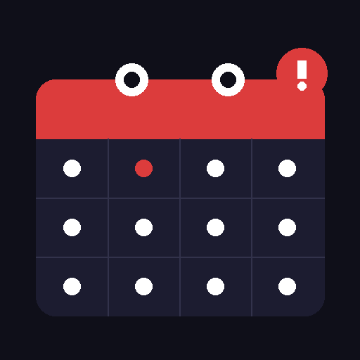

<p align="center">
  
</p>

<h1 align="center">Meeting Forcer</h1>

<p align="center">
  A macOS menu bar app that <strong>blacks out your entire screen</strong> when a meeting starts — and won't let go until you join.
</p>

<p align="center">
  
  
  
</p>

---

## The problem

You're in flow. Deep focus. Then a Slack message:

> *"Hey, are you joining the standup?"*

The meeting started 10 minutes ago. Again.

The issue isn't forgetting — it's that **joining a meeting requires you to consciously stop what you're doing**. Notifications are easy to ignore. Banners disappear. Calendar popups get clicked away.

## The solution

Meeting Forcer takes a different approach: when your meeting starts, **every screen goes black**. There is no dismiss button. There is no close. The only way out is to click **"Join Meeting"**.

No more "I'll join in 30 seconds" that turns into 10 minutes.

---

## Demo

> *(drop a screen recording GIF here)*

---

## Features

- **Full-screen blackout** — covers all monitors, sits above everything (screen-saver level)
- **One exit: Join** — clicking "Join Meeting" opens the URL and clears the screen
- **Snooze 5 min** — for when you genuinely need 5 more seconds
- **Google Calendar** — auto-detects Google Meet, Zoom, Teams, and Webex links from your events
- **Manual meetings** — add any meeting URL + time without calendar integration
- **Menu bar app** — lives quietly in your menu bar, zero dock presence
- **Auto-start on login** — one command to install as a LaunchAgent

---

## Requirements

- macOS 12 Monterey or later
- Python 3.10+

---

## Installation

```bash
git clone https://github.com/iztok/meeting-forcer.git
cd meeting-forcer
bash install.sh
./run.sh
```

That's it. A `📅` icon appears in your menu bar.

### Auto-start on login

```bash
bash install_login_item.sh
```

---

## Adding meetings

### Option A — Manual (no setup required)

Click `📅` → **Add Manual Meeting…** and enter:
1. The meeting URL (Google Meet, Zoom, Teams, Webex — any link works)
2. A title
3. A start time (HH:MM, 24 h)

The overlay fires 1 minute before the scheduled time.

### Option B — Google Calendar (automatic)

Meeting Forcer can read your Google Calendar and automatically trigger for any event that has a video conferencing link.

**One-time setup:**

1. Go to [console.cloud.google.com](https://console.cloud.google.com)
2. Create a project → **Enable the Google Calendar API**
3. Create **OAuth 2.0 credentials** (type: Desktop app)
4. Download the JSON and save it as:
   ```
   ~/.meeting-forcer/credentials.json
   ```
5. Restart Meeting Forcer — a browser window opens for sign-in

After that, it works automatically. The token is refreshed silently.

---

## Configuration

Edit the top of `app.py` to adjust:

| Variable | Default | Description |
|---|---|---|
| `TRIGGER_MINUTES_BEFORE` | `1` | Minutes before start to show the overlay |

---

## Project structure

```
meeting-forcer/
├── app.py               # Menu bar app (rumps)
├── overlay.py           # Full-screen blackout (PyObjC / NSWindow)
├── calendar_service.py  # Google Calendar API + URL extraction
├── meetings_store.py    # Manual meeting storage (~/.meeting-forcer/)
├── install.sh           # Venv + dependency setup
└── install_login_item.sh  # LaunchAgent for login auto-start
```

---

## How it works

The overlay is a borderless `NSWindow` set to `NSScreenSaverWindowLevel` (above all apps, the dock, and the menu bar). One window is created per monitor. The only interactive elements are the **Join** and **Snooze** buttons — everything else ignores mouse events.

Google Calendar events are polled every 60 seconds. Meeting URLs are extracted from `conferenceData.entryPoints` (Google Meet) or regex-matched from the event description/location (Zoom, Teams, Webex).

---

## Contributing

PRs welcome. Ideas for good first issues:

- [ ] Apple Calendar / iCal support via `EventKit`
- [ ] Configurable trigger time from menu bar
- [ ] Countdown timer on the overlay
- [ ] Sound/haptic alert before blackout

---

## License

MIT — see [LICENSE](LICENSE).
